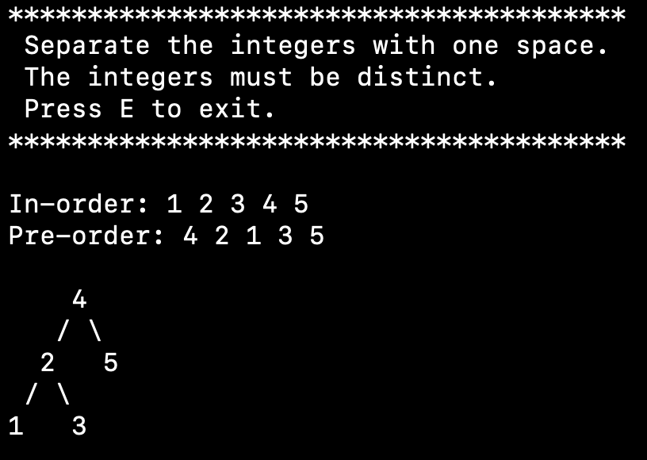

### Introduction

There are many online tools that visualize binary trees, but most of them ask the user to insert/remove nodes, which may be inconvinient.

This tool asks the user to type in the pre-order and in-order of the binary tree. By this way, when you are implementing some binary tree (e.g. treap), you can just dump the pre-order and in-order to see what your tree really looks like..

### Usage

`make a.out` or just `g++ main.cpp` to compile and simply run the program, and you can `make run` to see some examples generated by testing program.

### Screenshot

